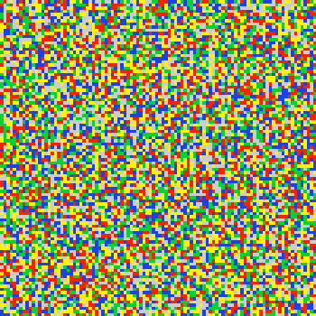

# Schelling Model of Racial Dynamics

A grid-based implementation of the Schelling model of racial dynamics. The model illustrates how micromotives can lead to macrobehavior, in particular, how local preferences for neighbors similar to oneself can lead to segregation on a large scale.

The rules for the model are simple:
* Iterate over the non-empty cells. 
* If the inhabitant of a cell is surrounded by a certain number of same-colored neighbors, the inhabitant is happy.
* Otherwise, the inhabitant is unhappy, and we move them to an empty cell at random.
* Repeat until we reach an equilibrium.

Play around [here](https://sleepokay.github.io/schelling/).
